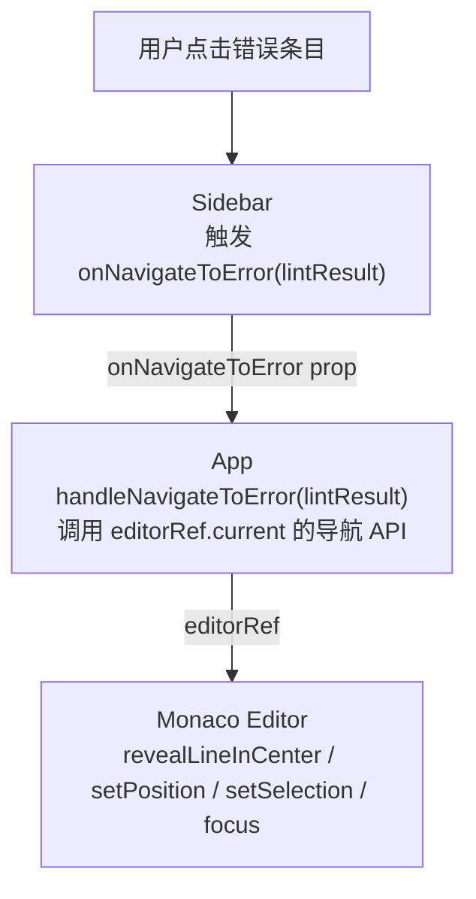

# 技术设计文档：Sidebar 错误导航

## 概述

本功能为 PromptLint 的 Sidebar 错误条目添加点击跳转能力。用户点击 Sidebar 中的某条 lint 结果后，Monaco Editor 将自动滚动至对应行并居中、移动光标到精确位置、高亮选中错误范围，并获取焦点。

整体设计遵循 React 单向数据流原则：Sidebar 只负责触发事件，App 持有 `editorRef` 并执行实际的编辑器操作，EditorPanel 无需感知此功能。

---

## 架构



数据流说明：
- `LintResult` 由 `useLint` 产生，存储在 App 的状态中，向下传递给 Sidebar
- 点击事件从 Sidebar 向上冒泡，通过 `onNavigateToError` 回调传回 App
- App 直接操作 `editorRef.current`，EditorPanel 不参与此流程

---

## 组件与接口

### SidebarProps（扩展）

在 `src/types/props.ts` 中为 `SidebarProps` 新增一个字段：

```typescript
onNavigateToError: (result: LintResult) => void
```

完整更新后的接口：

```typescript
export interface SidebarProps {
  score: number
  lintResults: LintResult[]
  analysis: any
  onAnalyze: () => void
  onFix: () => void
  isAnalyzing: boolean
  isFixing: boolean
  onNavigateToError: (result: LintResult) => void  // 新增
}
```

### App 层：handleNavigateToError

在 `App.tsx` 中定义回调函数，并传递给 Sidebar：

```typescript
const handleNavigateToError = (result: LintResult) => {
  const editor = editorRef.current
  if (!editor) return  // 防御性检查，editorRef 未就绪时静默忽略

  editor.revealLineInCenter(result.startLineNumber)
  editor.setPosition({
    lineNumber: result.startLineNumber,
    column: result.startColumn,
  })
  editor.setSelection({
    startLineNumber: result.startLineNumber,
    startColumn: result.startColumn,
    endLineNumber: result.endLineNumber,
    endColumn: result.endColumn,
  })
  editor.focus()
}
```

### Sidebar 组件：点击处理与样式

每条 `LintResult` 条目的 `div` 需要：
1. 绑定 `onClick={() => onNavigateToError(res)}`
2. 添加 `cursor-pointer` Tailwind 类
3. 添加 `hover:brightness-125` 或等效的 hover 高亮类

---

## 数据模型

本功能不引入新的数据模型，复用现有的 `LintResult`：

```typescript
interface LintResult {
  ruleId: string
  severity: 'error' | 'warning' | 'info'
  message: string
  startLineNumber: number  // 用于 revealLineInCenter、setPosition、setSelection
  startColumn: number      // 用于 setPosition、setSelection
  endLineNumber: number    // 用于 setSelection
  endColumn: number        // 用于 setSelection
}
```

Monaco Editor 导航 API 与 `LintResult` 字段的映射关系：

| Monaco API | 使用的字段 |
|---|---|
| `revealLineInCenter(line)` | `startLineNumber` |
| `setPosition({lineNumber, column})` | `startLineNumber`, `startColumn` |
| `setSelection({startLine, startCol, endLine, endCol})` | 全部四个位置字段 |
| `focus()` | 无（固定调用） |

---

## 正确性属性

*属性（Property）是在系统所有合法执行中都应成立的行为特征——本质上是对系统应做什么的形式化陈述。属性是人类可读规范与机器可验证正确性保证之间的桥梁。*

### 属性 1：Sidebar 点击触发正确的回调参数

*对任意* LintResult 列表，点击其中任意一条条目，`onNavigateToError` 回调应被调用恰好一次，且参数与被点击的 LintResult 完全一致。

**验证需求：1.1**

### 属性 2：导航操作正确调用所有 Monaco API

*对任意* 合法的 LintResult，调用 `handleNavigateToError` 后，Monaco Editor 的以下 API 应均被调用且参数正确：
- `revealLineInCenter(startLineNumber)`
- `setPosition({ lineNumber: startLineNumber, column: startColumn })`
- `setSelection({ startLineNumber, startColumn, endLineNumber, endColumn })`
- `focus()`

**验证需求：1.2, 1.3, 1.4, 1.5, 3.1**

### 属性 3：每条错误条目均具备 cursor-pointer 样式

*对任意* 非空的 LintResult 列表，Sidebar 渲染后，每条条目对应的 DOM 元素都应包含 `cursor-pointer` CSS 类。

**验证需求：2.1**

---

## 错误处理

| 场景 | 处理方式 |
|---|---|
| `editorRef.current` 为 null（编辑器未挂载） | 在 `handleNavigateToError` 开头做 guard check，直接 return，不抛出异常 |
| `lintResults` 为空数组 | Sidebar 不渲染任何可点击条目，无需处理 |
| LintResult 位置字段超出文档范围 | Monaco Editor 自身会处理越界情况，不额外处理 |

---

## 测试策略

### 单元测试（示例测试）

- 当 `editorRef.current` 为 null 时，调用 `handleNavigateToError` 不抛出异常（需求 3.4）
- Sidebar 渲染时，每条条目包含 hover 高亮相关的 Tailwind 类（需求 2.2）
- App 渲染时，Sidebar 接收到 `onNavigateToError` prop（需求 3.2）

### 属性测试（Property-Based Testing）

使用 **fast-check**（TypeScript 生态的 PBT 库）实现以下属性测试，每个属性最少运行 **100 次**迭代。

**属性 1 测试**
```
// Feature: sidebar-error-navigation, Property 1: Sidebar 点击触发正确的回调参数
fc.assert(fc.property(
  fc.array(lintResultArbitrary, { minLength: 1 }),
  fc.integer({ min: 0 }),
  (results, indexSeed) => {
    const idx = indexSeed % results.length
    // 渲染 Sidebar，点击第 idx 条，验证回调参数 === results[idx]
  }
), { numRuns: 100 })
```

**属性 2 测试**
```
// Feature: sidebar-error-navigation, Property 2: 导航操作正确调用所有 Monaco API
fc.assert(fc.property(
  lintResultArbitrary,
  (result) => {
    // mock editorRef，调用 handleNavigateToError(result)
    // 验证四个 API 均被以正确参数调用
  }
), { numRuns: 100 })
```

**属性 3 测试**
```
// Feature: sidebar-error-navigation, Property 3: 每条错误条目均具备 cursor-pointer 样式
fc.assert(fc.property(
  fc.array(lintResultArbitrary, { minLength: 1 }),
  (results) => {
    // 渲染 Sidebar，验证所有条目元素包含 cursor-pointer 类
  }
), { numRuns: 100 })
```

**LintResult 生成器（Arbitrary）**

```typescript
const lintResultArbitrary = fc.record({
  ruleId: fc.string({ minLength: 1 }),
  severity: fc.constantFrom('error', 'warning', 'info'),
  message: fc.string({ minLength: 1 }),
  startLineNumber: fc.integer({ min: 1, max: 1000 }),
  startColumn: fc.integer({ min: 1, max: 200 }),
  endLineNumber: fc.integer({ min: 1, max: 1000 }),
  endColumn: fc.integer({ min: 1, max: 200 }),
})
```
